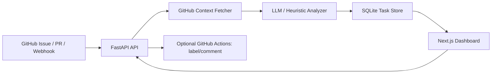

# AI Dev Workflow Copilot

AI Dev Workflow Copilot is a full-stack automation dashboard for GitHub engineering workflows. It analyzes issues, pull requests, and webhook payloads, then produces category, priority, impact area, suggested labels, action plan, test plan, acceptance criteria, review checklist, and a maintainer-ready comment.

This is designed as a portfolio-grade computer science internship project: it demonstrates GitHub API integration, webhook processing, background workflow status, LLM-assisted engineering analysis, deterministic fallback rules, frontend dashboard work, tests, CI, Docker, and cloud deployment readiness.

## Demo

- Frontend preview: https://ai-dev-workflow-copilot-frontend-fhonglei-fhongleis-projects.vercel.app
- Backend preview health: https://ai-dev-workflow-copilot-api-fhonglei-fhongleis-projects.vercel.app/api/health
- Demo script: `docs/DEMO_SCRIPT.md`
- Architecture: `docs/ARCHITECTURE.md`
- Technical blog: `docs/TECHNICAL_BLOG.md`
- Portfolio guide: `docs/PORTFOLIO.md`

Railway deployment is configured, but the current Railway free plan resource limit blocked provisioning a new service. The backend is currently deployed on Vercel preview in fallback mode. The frontend includes a local demo fallback, so the online dashboard can still demonstrate the full triage result UI if the backend is unreachable from a visitor's network.

## Features

- Analyze GitHub Issue URLs and PR URLs.
- Fetch GitHub context: issue/PR body, labels, README excerpt, changed files, and check-run summary when available.
- GitHub webhook endpoint for `issues` and `pull_request` events.
- Webhook Simulator for demoing the workflow without configuring a real webhook.
- CI failure log analyzer for pasted GitHub Actions or test logs.
- AI analysis with DeepSeek-compatible chat API.
- Rule-based fallback analysis when no LLM key is configured.
- Task states: `received -> fetching_context -> analyzing -> completed`.
- Optional automation hooks for applying labels and posting comments when `GITHUB_TOKEN` is configured.
- SQLite task history for local demos.
- Next.js dashboard with status polling and triage result panels.
- CI for backend tests and frontend lint/typecheck/build.
- Small triage evaluation set with category and priority accuracy metrics plus a CI accuracy threshold.
- Docker Compose for one-command local startup.

## Tech Stack

| Layer | Technology |
| --- | --- |
| Frontend | Next.js 15, React, TypeScript, Tailwind CSS |
| Backend | FastAPI, Pydantic, SQLite |
| AI | DeepSeek/OpenAI-compatible chat API with heuristic fallback |
| Integrations | GitHub REST API, GitHub Webhooks |
| DevOps | Docker Compose, Railway/Render backend, Vercel frontend |
| Testing | pytest, GitHub Actions |

## Architecture



## Quick Start

### Docker Compose

```bash
cp .env.example .env
docker compose up --build
```

Open:

- Frontend: `http://localhost:3000`
- Backend health: `http://localhost:8000/api/health`

### Manual Backend

```bash
cd backend
cp .env.example .env
pip install -r requirements.txt
uvicorn main:app --reload --port 8000
```

### Manual Frontend

```bash
cd frontend
cp .env.local.example .env.local
npm install
npm run dev
```

## Environment Variables

### Backend

| Variable | Required | Description |
| --- | --- | --- |
| `DEEPSEEK_API_KEY` | Optional | Enables LLM triage; fallback rules work without it |
| `DEEPSEEK_BASE_URL` | No | Default: `https://api.deepseek.com/v1` |
| `LLM_MODEL` | No | Default: `deepseek-chat` |
| `GITHUB_TOKEN` | Optional | Higher rate limits and optional label/comment automation |
| `GITHUB_WEBHOOK_SECRET` | Recommended | HMAC secret for GitHub webhook verification |
| `CORS_ORIGINS` | Yes in deployment | Comma-separated frontend URLs |
| `DATABASE_PATH` | No | SQLite task history path |

### Frontend

| Variable | Required | Description |
| --- | --- | --- |
| `NEXT_PUBLIC_API_URL` | Yes | Public backend API URL |

## API

| Method | Endpoint | Description |
| --- | --- | --- |
| `GET` | `/api/health` | Service and integration status |
| `POST` | `/api/analyze` | Start async analysis for a GitHub Issue/PR URL |
| `POST` | `/api/analyze/sync` | Run analysis synchronously for tests/demos |
| `POST` | `/api/analyze/ci-log` | Start async CI failure log analysis |
| `POST` | `/api/analyze/ci-log/sync` | Run CI failure log analysis synchronously |
| `GET` | `/api/tasks` | List recent workflow tasks |
| `GET` | `/api/tasks/{id}` | Fetch one task and analysis result |
| `POST` | `/api/webhooks/github` | GitHub webhook receiver |
| `POST` | `/api/webhooks/simulate` | Demo webhook payload simulator |

## Testing

Backend:

```bash
cd backend
pytest
```

Frontend:

```bash
cd frontend
npm run lint
npm run typecheck
npm run build
```

Triage evaluation:

```bash
cd backend
python scripts/evaluate_triage.py
```

The evaluation script writes `backend/evals/last_run.json` locally and fails CI if category or priority accuracy drops below the configured threshold.

## Deployment

Recommended:

- Frontend: Vercel, project root `frontend/`
- Backend: Railway, project root `backend/`

Backend variables:

```env
DEEPSEEK_API_KEY=...
GITHUB_TOKEN=...
GITHUB_WEBHOOK_SECRET=...
CORS_ORIGINS=https://your-vercel-domain.vercel.app
```

Frontend variable:

```env
NEXT_PUBLIC_API_URL=https://your-backend-domain
```

## Why This Helps Internship Applications

This project shows practical software engineering work rather than only prompt calling:

- Webhook-driven automation.
- Real GitHub API context retrieval.
- LLM output structured into engineering decisions.
- Background workflow states and task history.
- CI failure triage and an evaluation dataset for output quality.
- CI, tests, Docker, cloud deployment configuration.
- A realistic use case for developer productivity teams, internal tools teams, and AI engineering roles.

## Resume Bullets

- Built an AI-powered GitHub workflow automation tool that analyzes issues, pull requests, and webhook events into priority, labels, impact areas, action plans, test plans, and maintainer-ready comments.
- Integrated FastAPI with GitHub REST APIs and webhook signature validation, with optional automated label/comment actions using repository tokens.
- Implemented a Next.js dashboard for workflow task tracking, webhook simulation, and structured AI triage results.
- Added deterministic fallback triage rules, pytest coverage, Docker Compose, and GitHub Actions CI for production-oriented engineering quality.

## Roadmap

- Add GitHub App installation flow instead of personal tokens.
- Store tasks in PostgreSQL for production.
- Add Redis/RQ queue for high-volume webhook processing.
- Add CI failure log ingestion from GitHub Actions jobs.
- Expand the evaluation set with more labeled issues and PRs.
- Add user accounts and per-user repository isolation.
