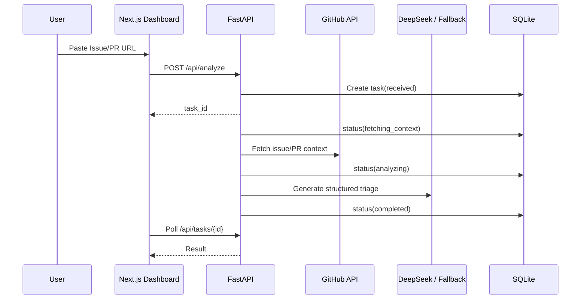

# Architecture

## System Boundary

AI Dev Workflow Copilot sits between GitHub and an engineering team. It receives GitHub URLs or webhook events, fetches repository context, analyzes the work item, stores a task record, and presents the result in a dashboard.

## Components

| Component | Responsibility |
| --- | --- |
| Next.js dashboard | Starts analyses, simulates webhooks, polls task state, displays structured results |
| FastAPI API | Accepts URL analysis requests, webhook payloads, and task queries |
| GitHub client | Fetches Issue/PR/README/file/check-run context |
| Analyzer | Uses DeepSeek when configured, otherwise deterministic fallback rules |
| CI log analyzer | Converts pasted CI/test logs into the same triage schema |
| SQLite store | Stores workflow tasks and analysis output |
| GitHub automation | Optionally posts comments and applies labels when `GITHUB_TOKEN` is configured |

## Workflow

## Security Model

- API keys are backend-only environment variables.
- Frontend only receives `NEXT_PUBLIC_API_URL`.
- GitHub webhook signatures are verified when `GITHUB_WEBHOOK_SECRET` is set.
- Automated comment/label actions are disabled unless `GITHUB_TOKEN` is configured.
- LLM fallback mode keeps demos usable without secrets.

## Production Hardening Path

- Replace personal access token with a GitHub App.
- Move SQLite to PostgreSQL.
- Move background work to Redis/RQ or Celery.
- Add rate limiting for webhook and analysis endpoints.
- Add Sentry or OpenTelemetry for production observability.
- Add an evaluation dataset for triage quality.
